---
## Front matter
title: "Отчёт по лабораторной работе 7"
subtitle: "Команды безусловного и условного переходов в Nasm. Программирование ветвлений"
author: "Тукаев Тимур Ильшатович НММбд-03-23"

## Generic otions
lang: ru-RU
toc-title: "Содержание"

## Bibliography
bibliography: bib/cite.bib
csl: pandoc/csl/gost-r-7-0-5-2008-numeric.csl

## Pdf output format
toc: true # Table of contents
toc-depth: 2
lof: true # List of figures
lot: true # List of tables
fontsize: 12pt
linestretch: 1.5
papersize: a4
documentclass: scrreprt
## I18n polyglossia
polyglossia-lang:
  name: russian
  options:
	- spelling=modern
	- babelshorthands=true
polyglossia-otherlangs:
  name: english
## I18n babel
babel-lang: russian
babel-otherlangs: english
## Fonts
mainfont: PT Serif
romanfont: PT Serif
sansfont: PT Sans
monofont: PT Mono
mainfontoptions: Ligatures=TeX
romanfontoptions: Ligatures=TeX
sansfontoptions: Ligatures=TeX,Scale=MatchLowercase
monofontoptions: Scale=MatchLowercase,Scale=0.9
## Biblatex
biblatex: true
biblio-style: "gost-numeric"
biblatexoptions:
  - parentracker=true
  - backend=biber
  - hyperref=auto
  - language=auto
  - autolang=other*
  - citestyle=gost-numeric
## Pandoc-crossref LaTeX customization
figureTitle: "Рис."
tableTitle: "Таблица"
listingTitle: "Листинг"
lofTitle: "Список иллюстраций"
lotTitle: "Список таблиц"
lolTitle: "Листинги"
## Misc options
indent: true
header-includes:
  - \usepackage{indentfirst}
  - \usepackage{float} # keep figures where there are in the text
  - \floatplacement{figure}{H} # keep figures where there are in the text
---

# Цель работы

Целью работы является изучение команд условного и безусловного переходов. Приобретение навыков написания программ с использованием переходов. Знакомство с назначением и структурой файла листинга.

# Выполнение лабораторной работы

1. Создал каталог для программам лабораторной работы № 7 и файл lab7-1.asm

2. Инструкция jmp в NASM используется для реализации безусловных переходов. Рассмотрим пример программы с использованием инструкции jmp.

Написал в файл lab7-1.asm текст программы из листинга 7.1.

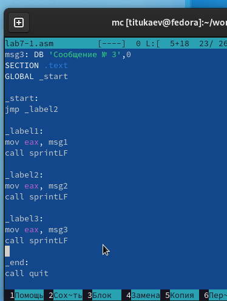{ #fig:001 width=70%, height=70% }

Также размещаю код программы в отчете.

```
%include 'in_out.asm'
SECTION .data
msg1: DB 'Сообщение № 1',0
msg2: DB 'Сообщение № 2',0
msg3: DB 'Сообщение № 3',0
SECTION .text
GLOBAL _start

_start:
jmp _label2

_label1:
mov eax, msg1
call sprintLF

_label2:
mov eax, msg2
call sprintLF

_label3:
mov eax, msg3
call sprintLF

_end:
call quit
```

Создал исполняемый файл и запустил его.

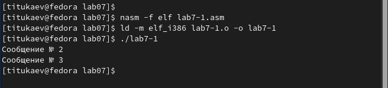{ #fig:002 width=70%, height=70% }

Инструкция jmp позволяет осуществлять переходы не только вперед но и назад. 
Изменим программу таким образом, чтобы она выводила сначала ‘Сообщение № 2’, потом ‘Сообщение № 1’ и завершала работу. 
Для этого в текст программы после вывода сообщения № 2 добавим инструкцию jmp с меткой _label1 
(т.е. переход к инструкциям вывода сообщения № 1) и после вывода сообщения № 1 добавим инструкцию jmp с меткой _end 
(т.е. переход к инструкции call quit). 

Изменил текст программы в соответствии с листингом 7.2.

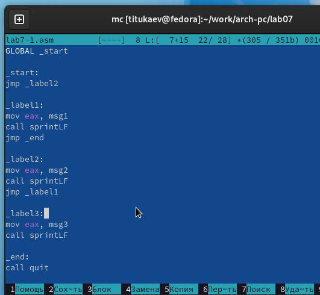{ #fig:003 width=70%, height=70% }

Также размещаю код программы в отчете.

```
%include 'in_out.asm'
SECTION .data
msg1: DB 'Сообщение № 1',0
msg2: DB 'Сообщение № 2',0
msg3: DB 'Сообщение № 3',0
SECTION .text
GLOBAL _start

_start:
jmp _label2

_label1:
mov eax, msg1
call sprintLF
jmp _end

_label2:
mov eax, msg2
call sprintLF
jmp _label1

_label3:
mov eax, msg3
call sprintLF

_end:
call quit
```

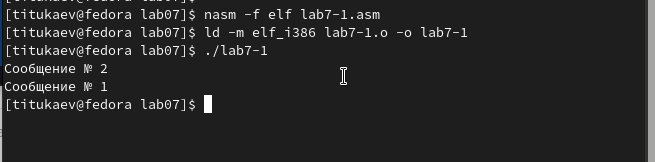{ #fig:004 width=70%, height=70% }

Изменил текст программы, изменив инструкции jmp, чтобы вывод программы был следующим:
```
Сообщение № 3
Сообщение № 2
Сообщение № 1
```

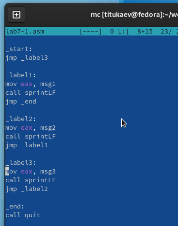{ #fig:005 width=70%, height=70% }

Также размещаю код программы в отчете.

```
%include 'in_out.asm'
SECTION .data
msg1: DB 'Сообщение № 1',0
msg2: DB 'Сообщение № 2',0
msg3: DB 'Сообщение № 3',0
SECTION .text
GLOBAL _start

_start:
jmp _label3

_label1:
mov eax, msg1
call sprintLF
jmp _end

_label2:
mov eax, msg2
call sprintLF
jmp _label1

_label3:
mov eax, msg3
call sprintLF
jmp _label2

_end:
call quit
```

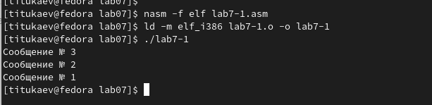{ #fig:006 width=70%, height=70% }

3. Использование инструкции jmp приводит к переходу в любом случае. 
Однако, часто при написании программ необходимо использовать условные переходы, 
т.е. переход должен происходить если выполнено какое-либо условие. 
В качестве примера рассмотрим программу, которая определяет и выводит на экран наибольшую из 3 целочисленных переменных: A,B и C. 
Значения для A и C задаются в программе, значение B вводиться с клавиатуры. 

Создал исполняемый файл и проверил его работу для разных значений B.

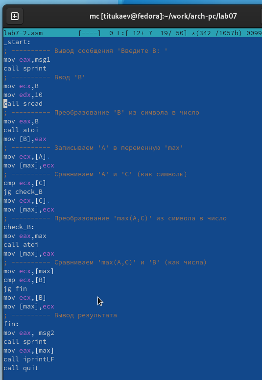{ #fig:007 width=70%, height=70% }

Также размещаю код программы в отчете.

```
%include 'in_out.asm'
section .data
msg1 db 'Введите B: ',0h
msg2 db "Наибольшее число: ",0h
A dd '20'
C dd '50'
section .bss
max resb 10
B resb 10
section .text
global _start
_start:
; ---------- Вывод сообщения 'Введите B: '
mov eax,msg1
call sprint
; ---------- Ввод 'B'
mov ecx,B
mov edx,10
call sread
; ---------- Преобразование 'B' из символа в число
mov eax,B
call atoi
mov [B],eax
; ---------- Записываем 'A' в переменную 'max'
mov ecx,[A] 
mov [max],ecx
; ---------- Сравниваем 'A' и 'С' (как символы)
cmp ecx,[C]
jg check_B
mov ecx,[C] 
mov [max],ecx
; ---------- Преобразование 'max(A,C)' из символа в число
check_B:
mov eax,max
call atoi
mov [max],eax
; ---------- Сравниваем 'max(A,C)' и 'B' (как числа)
mov ecx,[max]
cmp ecx,[B]
jg fin
mov ecx,[B]
mov [max],ecx
; ---------- Вывод результата
fin:
mov eax, msg2
call sprint
mov eax,[max]
call iprintLF
call quit
```

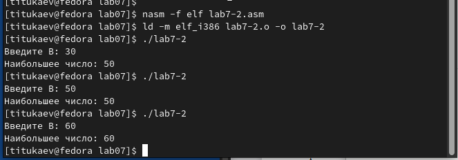{ #fig:008 width=70%, height=70% }

4. Обычно nasm создаёт в результате ассемблирования только объектный файл. 
Получить файл листинга можно, указав ключ -l и задав имя файла листинга в командной строке. 

Создал файл листинга для программы из файла lab7-2.asm

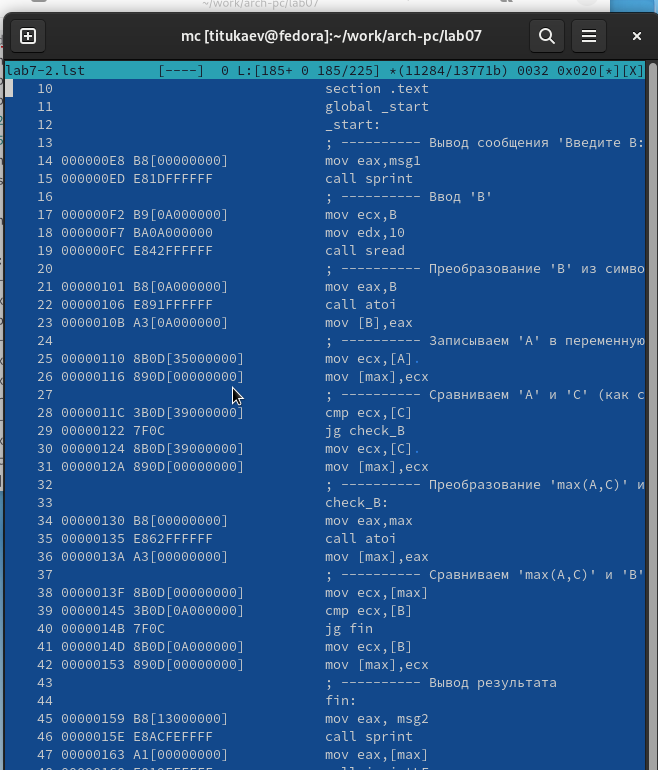{ #fig:009 width=70%, height=70% }

Внимательно ознакомился с его форматом и содержимым. 
Подробно объясню содержимое трёх строк файла листинга по выбору.

строка 21

* 21 - номер строки

* 00000101 - адрес

* B8[0A000000]  - машинный код

* mov eax,B - код программы

строка 22

* 22 - номер строки

* 00000106 - адрес

* E891FFFFFF - машинный код

* call atoi- код программы

строка 23

* 23 - номер строки

* 0000010B - адрес

* A3[0A000000] - машинный код

* mov [B],eax - код программы

Открыл файл с программой lab7-2.asm и в инструкции с двумя операндами удалил один операнд. 
Выполнил трансляцию с получением файла листинга.

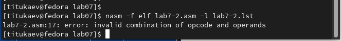{ #fig:010 width=70%, height=70% }

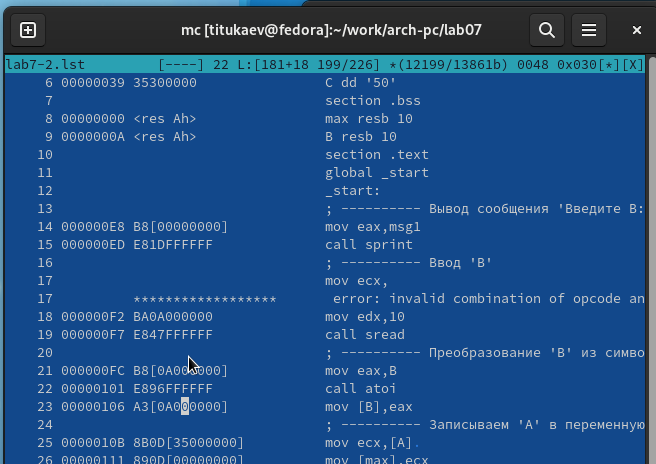{ #fig:011 width=70%, height=70% }

Объектный файл не смог создаться из-за ошибки. Но получился листинг, где выделено место ошибки.

5. Напишите программу нахождения наименьшей из 3 целочисленных переменных a,b и c. 
Значения переменных выбрать из табл. 7.5 в соответствии с вариантом, полученным при выполнении лабораторной работы № 6.
Создайте исполняемый файл и проверьте его работу

для варианта 5 - 54, 62, 87

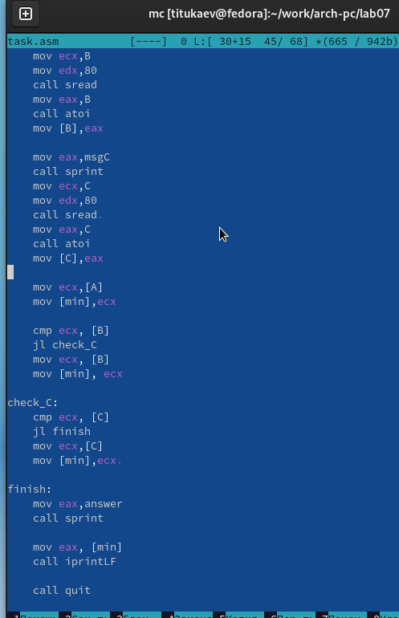{ #fig:012 width=70%, height=70% }

Также размещаю код программы в отчете.

```
%include 'in_out.asm'
SECTION .data
    msgA:	DB 'Input A: ',0
    msgB:       DB 'Input B: ',0
    msgC:	DB 'Input C: ',0
    answer:	DB 'Smallest: ',0

SECTION .bss
    A:	RESB 80
    B:  RESB 80
    C:  RESB 80
    result:     RESB 80
    min: RESB 80

SECTION .text
    GLOBAL _start

_start:
    mov eax,msgA
    call sprint
    mov ecx,A
    mov edx,80
    call sread
    mov eax,A
    call atoi 
    mov [A],eax

    mov eax, msgB
    call sprint
    mov ecx,B
    mov edx,80
    call sread
    mov eax,B
    call atoi
    mov [B],eax

    mov eax,msgC
    call sprint
    mov ecx,C
    mov edx,80
    call sread 
    mov eax,C
    call atoi
    mov [C],eax   
    
    mov ecx,[A]
    mov [min],ecx

    cmp ecx, [B]
    jl check_C
    mov ecx, [B]
    mov [min], ecx

check_C:
    cmp ecx, [C]
    jl finish
    mov ecx,[C]
    mov [min],ecx 

finish:
    mov eax,answer
    call sprint

    mov eax, [min]
    call iprintLF

    call quit
```

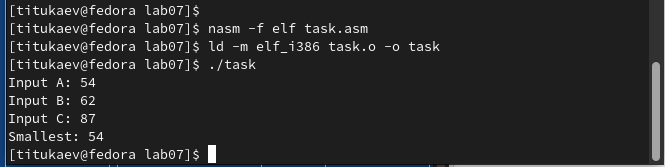{ #fig:013 width=70%, height=70% }

6. Напишите программу, которая для введенных с клавиатуры значений x и a вычисляет значение заданной функции f(x) и выводит результат вычислений. 
Вид функции f(x) выбрать из таблицы 7.6 вариантов заданий в соответствии с вариантом, полученным при выполнении лабораторной работы № 7. 
Создайте исполняемый файл и проверьте его работу для значений X и a из 7.6.

для варианта 5

$$
 \begin{cases}
	2(x-a), x > a
	\\   
	15, x \le a
 \end{cases}
$$

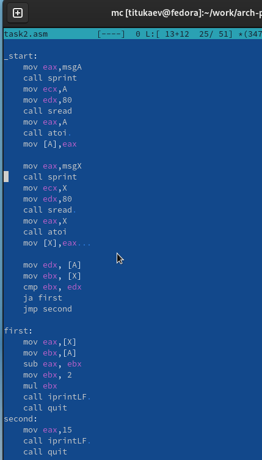{ #fig:014 width=70%, height=70% }

Также размещаю код программы в отчете.

```
%include 'in_out.asm'
SECTION .data
    msgA:	DB 'Input A: ',0
    msgX:       DB 'Input X: ',0

SECTION .bss
    A:	RESB 80
    X:  RESB 80
    result:     RESB 80

SECTION .text
    GLOBAL _start

_start:
    mov eax,msgA
    call sprint
    mov ecx,A
    mov edx,80
    call sread
    mov eax,A
    call atoi 
    mov [A],eax

    mov eax,msgX
    call sprint
    mov ecx,X
    mov edx,80
    call sread 
    mov eax,X
    call atoi
    mov [X],eax   

    mov edx, [A]
    mov ebx, [X]
    cmp ebx, edx
    ja first
    jmp second

first:
    mov eax,[X]
    mov ebx,[A]
    sub eax, ebx
    mov ebx, 2
    mul ebx
    call iprintLF 
    call quit
second:
    mov eax,15
    call iprintLF 
    call quit
```

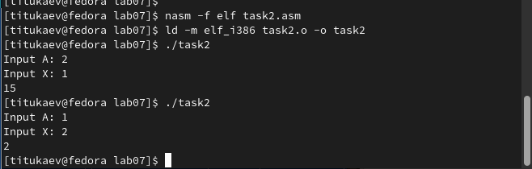{ #fig:015 width=70%, height=70% }

# Выводы

Изучили команды условного и безусловного переходов, познакомились с фалом листинга.
