---
## Front matter
title: "Отчёт по лабораторной работе 9"
subtitle: "Понятие подпрограммы. Отладчик GDB."
author: "Тукаев Тимур Ильшатович НММбд-03-23"

## Generic otions
lang: ru-RU
toc-title: "Содержание"

## Bibliography
bibliography: bib/cite.bib
csl: pandoc/csl/gost-r-7-0-5-2008-numeric.csl

## Pdf output format
toc: true # Table of contents
toc-depth: 2
lof: true # List of figures
lot: true # List of tables
fontsize: 12pt
linestretch: 1.5
papersize: a4
documentclass: scrreprt
## I18n polyglossia
polyglossia-lang:
  name: russian
  options:
	- spelling=modern
	- babelshorthands=true
polyglossia-otherlangs:
  name: english
## I18n babel
babel-lang: russian
babel-otherlangs: english
## Fonts
mainfont: PT Serif
romanfont: PT Serif
sansfont: PT Sans
monofont: PT Mono
mainfontoptions: Ligatures=TeX
romanfontoptions: Ligatures=TeX
sansfontoptions: Ligatures=TeX,Scale=MatchLowercase
monofontoptions: Scale=MatchLowercase,Scale=0.9
## Biblatex
biblatex: true
biblio-style: "gost-numeric"
biblatexoptions:
  - parentracker=true
  - backend=biber
  - hyperref=auto
  - language=auto
  - autolang=other*
  - citestyle=gost-numeric
## Pandoc-crossref LaTeX customization
figureTitle: "Рис."
tableTitle: "Таблица"
listingTitle: "Листинг"
lofTitle: "Список иллюстраций"
lotTitle: "Список таблиц"
lolTitle: "Листинги"
## Misc options
indent: true
header-includes:
  - \usepackage{indentfirst}
  - \usepackage{float} # keep figures where there are in the text
  - \floatplacement{figure}{H} # keep figures where there are in the text
---

# Цель работы

Целью работы является приобретение навыков написания программ с использованием подпрограмм.
Знакомство с методами отладки при помощи GDB и его основными возможностями.

# Выполнение лабораторной работы

1. Создал каталог для выполнения лабораторной работы № 9, перешел
в него и создал файл lab9-1.asm.

2. В качестве примера рассмотрим программу вычисления арифметического
выражения $f(x) = 2x+7$ с помощью подпрограммы calcul. В данном
примере $x$ вводится с клавиатуры, а само выражение вычисляется в подпрограмме. 

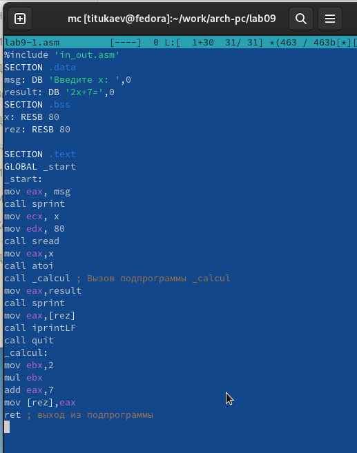{ #fig:001 width=70%, height=70% }

Также размещаю код программы в отчете.

```
%include 'in_out.asm'
SECTION .data
msg: DB 'Введите x: ',0
result: DB '2x+7=',0
SECTION .bss
x: RESB 80
rez: RESB 80

SECTION .text
GLOBAL _start
_start:
mov eax, msg
call sprint
mov ecx, x
mov edx, 80
call sread
mov eax,x
call atoi
call _calcul ; Вызов подпрограммы _calcul
mov eax,result
call sprint
mov eax,[rez]
call iprintLF
call quit
_calcul:
mov ebx,2
mul ebx
add eax,7
mov [rez],eax
ret ; выход из подпрограммы
```

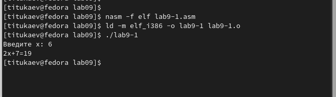{ #fig:002 width=70%, height=70% }

3. Изменил текст программы, добавив подпрограмму subcalcul в подпрограмму calcul, 
для вычисления выражения $f(g(x))$, где $x$ вводится с клавиатуры, 
$f(x) = 2x + 7, g(x) = 3x − 1$.

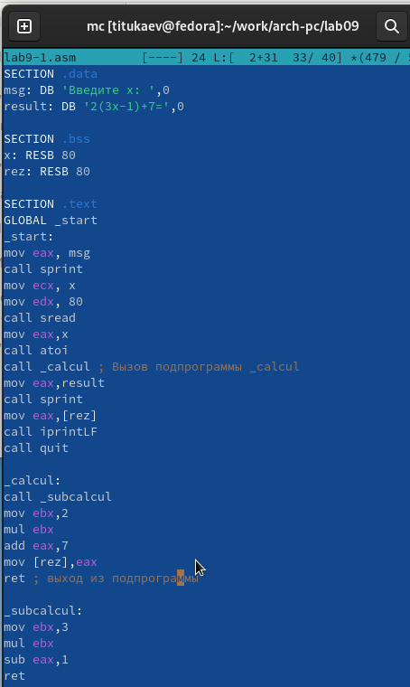{ #fig:003 width=70%, height=70% }

Код программы

```
%include 'in_out.asm'
SECTION .data
msg: DB 'Введите x: ',0
result: DB '2(3x-1)+7=',0

SECTION .bss
x: RESB 80
rez: RESB 80

SECTION .text
GLOBAL _start
_start:
mov eax, msg
call sprint
mov ecx, x
mov edx, 80
call sread
mov eax,x
call atoi
call _calcul ; Вызов подпрограммы _calcul
mov eax,result
call sprint
mov eax,[rez]
call iprintLF
call quit

_calcul:
call _subcalcul
mov ebx,2
mul ebx
add eax,7
mov [rez],eax
ret ; выход из подпрограммы

_subcalcul:
mov ebx,3
mul ebx
sub eax,1
ret
```

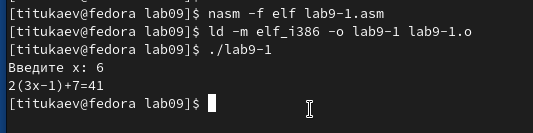{ #fig:004 width=70%, height=70% }

4. Создал файл lab9-2.asm с текстом программы из Листинга 9.2. (Программа печати сообщения Hello world!).

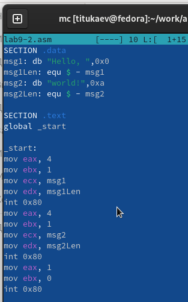{ #fig:005 width=70%, height=70% }

Также размещаю код программы в отчете.

```
SECTION .data
msg1: db "Hello, ",0x0
msg1Len: equ $ - msg1
msg2: db "world!",0xa
msg2Len: equ $ - msg2

SECTION .text
global _start

_start:
mov eax, 4
mov ebx, 1
mov ecx, msg1
mov edx, msg1Len
int 0x80
mov eax, 4
mov ebx, 1
mov ecx, msg2
mov edx, msg2Len
int 0x80
mov eax, 1
mov ebx, 0
int 0x80
```

Получил исполняемый файл. Для работы с GDB в исполняемый файл необходимо 
добавить отладочную информацию, для этого трансляцию программ необходимо проводить с ключом ‘-g’.

Загрузил исполняемый файл в отладчик gdb.
Проверил работу программы, запустив ее в оболочке GDB с помощью команды run 
(сокращённо r).

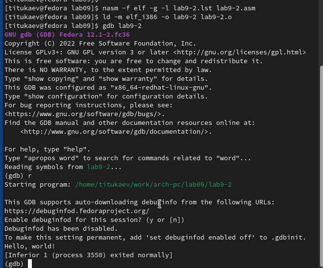{ #fig:006 width=70%, height=70% }

Для более подробного анализа программы установите брейкпоинт на метку
start, с которой начинается выполнение любой ассемблерной программы, и запустите её.
Посмотрите дисассимилированный код программы.

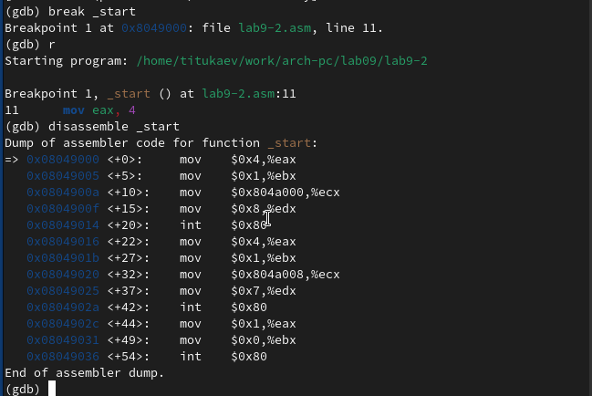{ #fig:007 width=70%, height=70% }

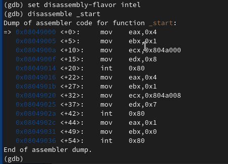{ #fig:008 width=70%, height=70% }

На предыдущих шагах была установлена точка остановки по имени метки (_start). 
Проверил это с помощью команды info breakpoints (кратко i b).
Установил еще одну точку остановки по адресу инструкции. 
Адрес инструкции можно увидеть в средней части экрана в левом столбце соответствующей
инструкции. Определил адрес предпоследней инструкции (mov ebx,0x0) и установил точку.

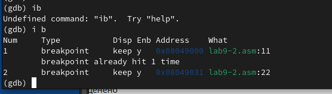{ #fig:009 width=70%, height=70% }

Отладчик может показывать содержимое ячеек памяти и регистров, а при
необходимости позволяет вручную изменять значения регистров и переменных.
Выполнил 5 инструкций с помощью команды stepi (или si) и проследил за
изменением значений регистров.

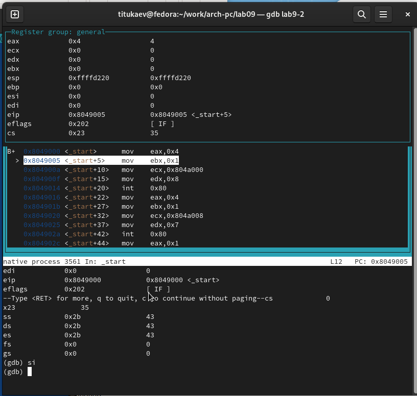{ #fig:010 width=70%, height=70% }

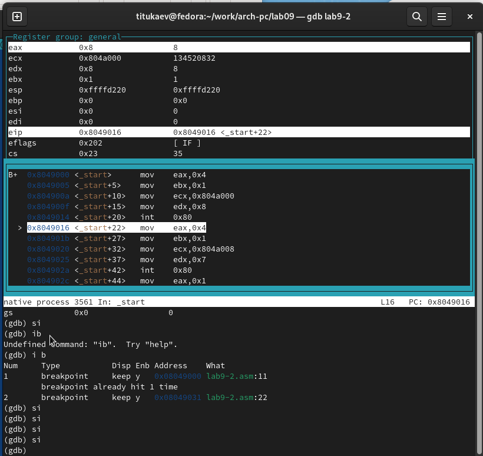{ #fig:011 width=70%, height=70% }

Посмотрел значение переменной msg1 по имени.
Посмотрел значение переменной msg2 по адресу.

Изменить значение для регистра или ячейки памяти можно с помощью команды set, 
задав ей в качестве аргумента имя регистра или адрес. 
Изменил первый символ переменной msg1.

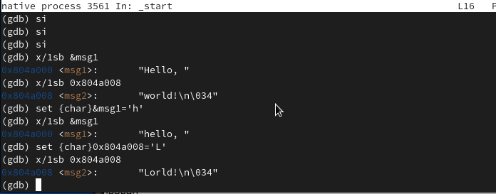{ #fig:012 width=70%, height=70% }

Вывел в различных форматах (в шестнадцатеричном формате, в двоичном формате и в символьном виде) 
значение регистра edx.

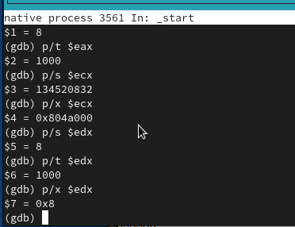{ #fig:013 width=70%, height=70% }

С помощью команды set изменил значение регистра ebx

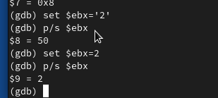{ #fig:014 width=70%, height=70% }

5. Скопировал файл lab8-2.asm, созданный при выполнении лабораторной работы №8, 
с программой выводящей на экран аргументы командной строки. Создал исполняемый файл.
Для загрузки в gdb программы с аргументами необходимо использовать ключ
--args. Загрузил исполняемый файл в отладчик, указав аргументы.

Код программы

```
%include 'in_out.asm'
SECTION .text
global _start
_start:
pop ecx ; Извлекаем из стека в `ecx` количество
; аргументов (первое значение в стеке)
pop edx ; Извлекаем из стека в `edx` имя программы
; (второе значение в стеке)
sub ecx, 1 ; Уменьшаем `ecx` на 1 (количество
; аргументов без названия программы)
next:
cmp ecx, 0 ; проверяем, есть ли еще аргументы
jz _end ; если аргументов нет выходим из цикла
; (переход на метку `_end`)
pop eax ; иначе извлекаем аргумент из стека
call sprintLF ; вызываем функцию печати
loop next ; переход к обработке следующего
; аргумента (переход на метку `next`)
_end:
call quit
```

Для начала установил точку останова перед первой инструкцией в программе и запустил ее.

Адрес вершины стека храниться в регистре esp и по этому адресу располагается число равное количеству 
аргументов командной строки (включая имя программы).
Как видно, число аргументов равно 5 – это имя программы lab9-3 и 
непосредственно аргументы: аргумент1, аргумент, 2 и 'аргумент 3'.

Посмотрел остальные позиции стека – по адесу [esp+4] располагается адрес
в памяти где находиться имя программы, по адесу [esp+8] храниться адрес
первого аргумента, по аресу [esp+12] – второго и т.д.

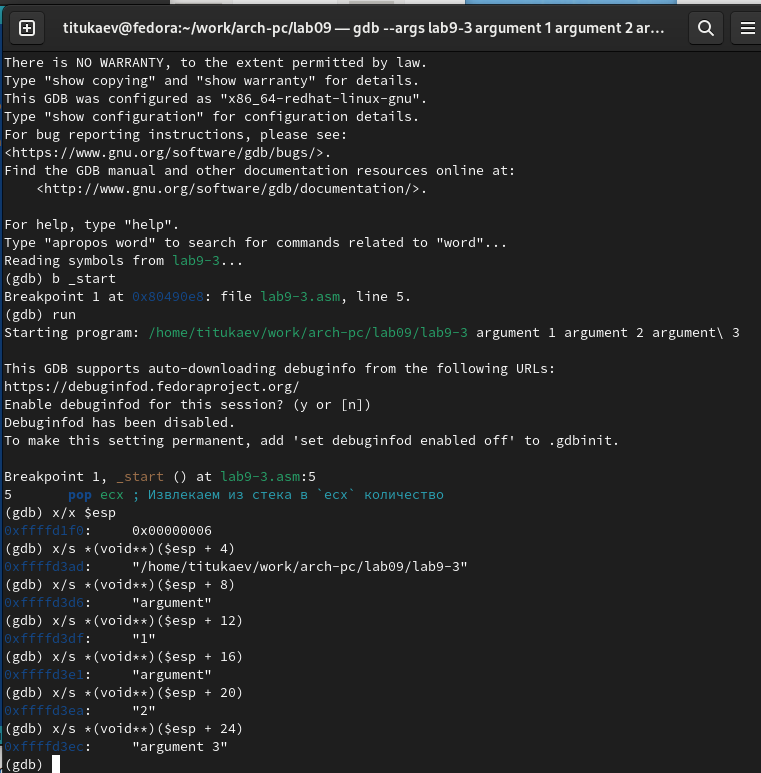{ #fig:015 width=70%, height=70% }

Объясню, почему шаг изменения адреса равен 4 ([esp+4], [esp+8], [esp+12] - 
шаг равен размеру переменной - 4 байтам.

6. Преобразовал программу из лабораторной работы №8 (Задание №1 для
самостоятельной работы), реализовав вычисление значения функции f(x)
как подпрограмму.

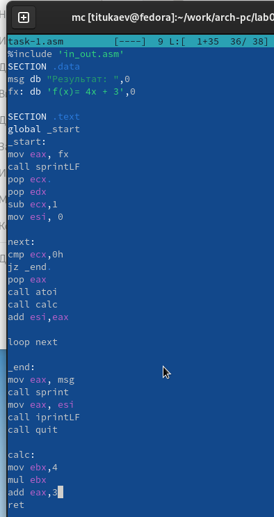{ #fig:016 width=70%, height=70% }

Также размещаю код программы в отчете.

```
%include 'in_out.asm'
SECTION .data
msg db "Результат: ",0
fx: db 'f(x)= 4x + 3',0

SECTION .text
global _start
_start:
mov eax, fx
call sprintLF
pop ecx 
pop edx
sub ecx,1
mov esi, 0

next:
cmp ecx,0h
jz _end 
pop eax
call atoi
call calc
add esi,eax

loop next

_end:
mov eax, msg
call sprint
mov eax, esi
call iprintLF
call quit

calc:
mov ebx,4
mul ebx
add eax,3
ret
```

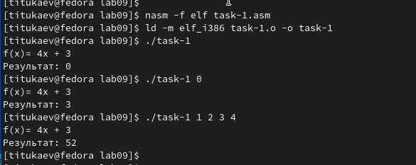{ #fig:017 width=70%, height=70% }

7. В листинге приведена программа вычисления выражения $(3+2)*4+5$.
При запуске данная программа дает неверный результат. Проверил это.
С помощью отладчика GDB, анализируя изменения значений регистров,
определю ошибку и исправлю ее.

Также размещаю код программы в отчете.

```
%include 'in_out.asm'
SECTION .data
div: DB 'Результат: ',0
SECTION .text
GLOBAL _start
_start:
; ---- Вычисление выражения (3+2)*4+5
mov ebx,3
mov eax,2
add ebx,eax
mov ecx,4
mul ecx
add ebx,5
mov edi,ebx
; ---- Вывод результата на экран
mov eax,div
call sprint
mov eax,edi
call iprintLF
call quit
```

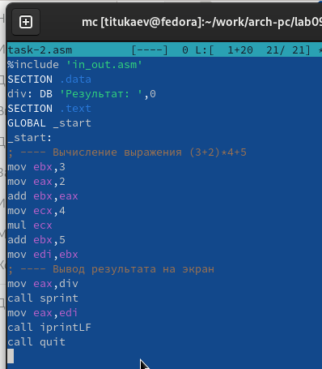{ #fig:018 width=70%, height=70% }

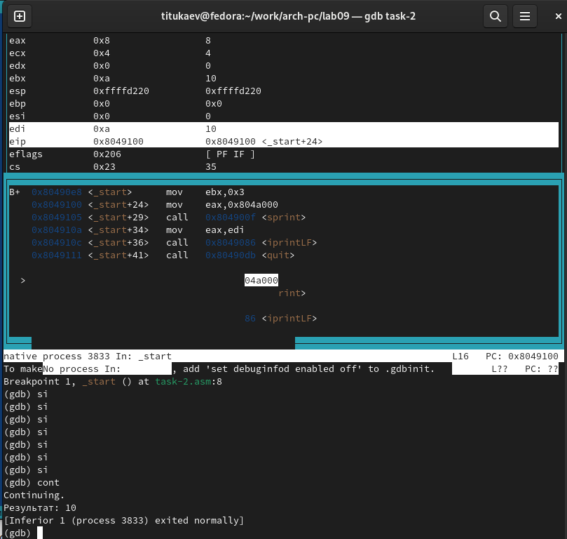{ #fig:019 width=70%, height=70% }

Отмечу, что перепутан порядок аргументов у инструкции add и что по окончании работы в edi отправляется ebx вместо eax

Исправленный код программы

```
%include 'in_out.asm'
SECTION .data
div: DB 'Результат: ',0
SECTION .text
GLOBAL _start
_start:
; ---- Вычисление выражения (3+2)*4+5
mov ebx,3
mov eax,2
add eax,ebx
mov ecx,4
mul ecx
add eax,5
mov edi,eax
; ---- Вывод результата на экран
mov eax,div
call sprint
mov eax,edi
call iprintLF
call quit
```

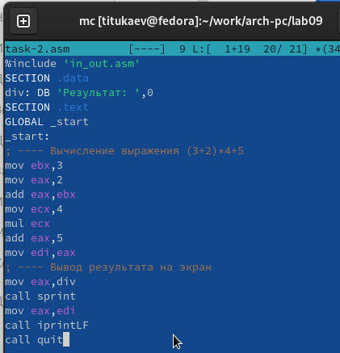{ #fig:020 width=70%, height=70% }

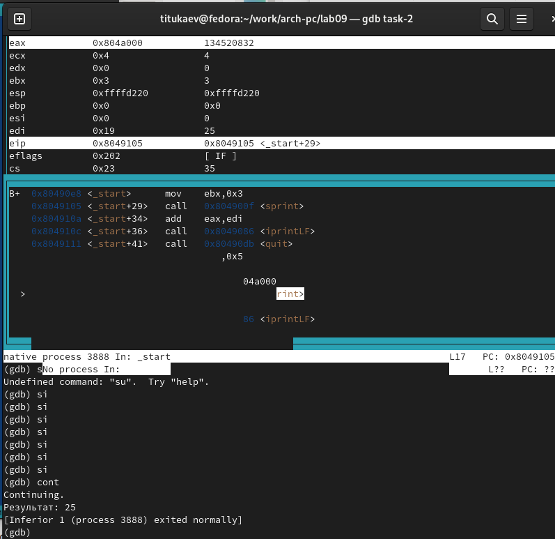{ #fig:021 width=70%, height=70% }

# Выводы

Освоили работy с подпрограммами и отладчиком.